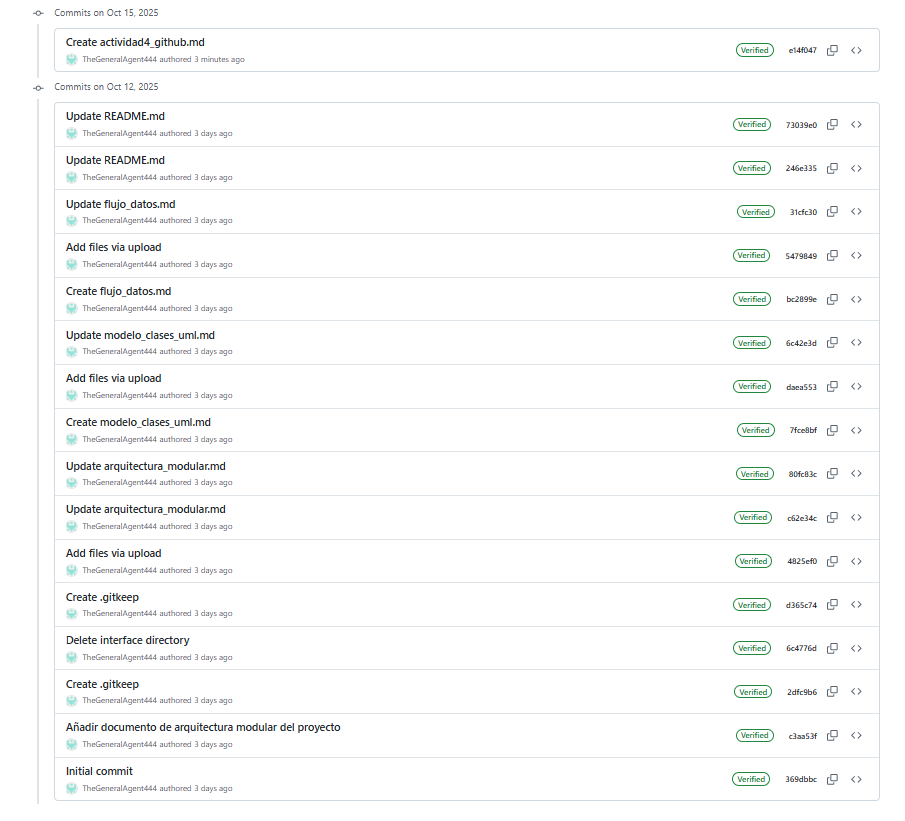

# Guía Turística Inteligente con IA y Geolocalización  
## Actividad 4 – Git y GitHub (Desarrollo Colaborativo)

**Fundación Universitaria Lumen Gentium (UNICATÓLICA)**  
**Asignatura:** Desarrollo de Software I  
**Docente:** Stephany Ramírez Posada  
**Integrantes:**  
- Luisa Gironza Beltrán (ID: 408993)  
- Jose Luis Hoyos Salazar (ID: 408716)

---

### Propósito de la Actividad
Implementar el control de versiones del proyecto de manera colaborativa mediante **Git y GitHub**, permitiendo la organización del código, documentación y evidencias del desarrollo.

---

##  1. Repositorio Grupal

El proyecto se encuentra alojado en GitHub bajo el nombre:

👉 **Repositorio:**  
[https://github.com/JoseHoyosSalazar/guia-turistica-inteligente](https://github.com/JoseHoyosSalazar/guia-turistica-inteligente)

El repositorio contiene toda la estructura establecida por el taller grupal:
/docs/ → Documentación técnica del sistema
/interfaces/ → Diagramas, mockups y evidencias
README.md → Descripción general del proyecto

---

##  2. Estructura del Repositorio

| Carpeta / Archivo | Descripción |
|-------------------|-------------|
| `/docs/arquitectura_modular.md` | Describe la arquitectura del sistema por capas |
| `/docs/modelo_clases_uml.md` | Contiene el diagrama UML de clases |
| `/docs/flujo_datos.md` | Explica el flujo de información entre capas |
| `/docs/interfaces.md` | Describe las interfaces diseñadas (mockups) |
| `/docs/tablero_agil.md` | Documenta el tablero Kanban del equipo |
| `/interfaces/` | Carpeta con imágenes, diagramas y evidencias |
| `README.md` | Archivo raíz con descripción general del proyecto |

---

##  3. Colaboración y Commits

Cada integrante realizó al menos **dos commits** documentados en el historial del repositorio.

| Integrante | Aporte | Archivos modificados | Fecha |
|-------------|---------|----------------------|--------|
| **Jose Luis Hoyos** | Documentación técnica, UML y flujo de datos | `docs/flujo_datos.md`, `docs/modelo_clases_uml.md` | 12/10/2025 |
| **Luisa Gironza** | Diseño de interfaces, wireframes y tablero ágil | `docs/interfaces.md`, `interfaces/*.png`, `docs/tablero_agil.md` | 12/10/2025 |

---

## 🖼️ 4. Evidencia de Commits

A continuación se muestra la evidencia visual del historial de commits en GitHub:

---

##  5. Conclusión

El uso de **GitHub** permitió llevar un control de versiones colaborativo, mantener la trazabilidad de los cambios y centralizar toda la documentación del proyecto.

Cada integrante aportó en su área de responsabilidad (diseño, documentación o diagramación), garantizando un flujo de trabajo ágil y organizado.

---

##  6. Entregable

- **URL del Repositorio:**  
  [https://github.com/JoseHoyosSalazar/guia-turistica-inteligente](https://github.com/JoseHoyosSalazar/guia-turistica-inteligente)

- **Captura de Commits:**  
  `/interfaces/commits_equipo.png`

