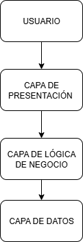
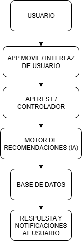
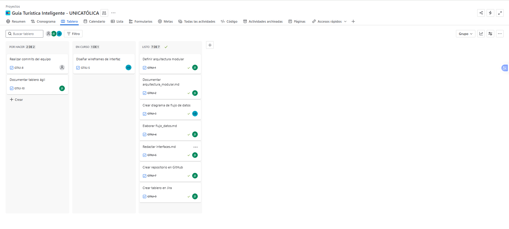
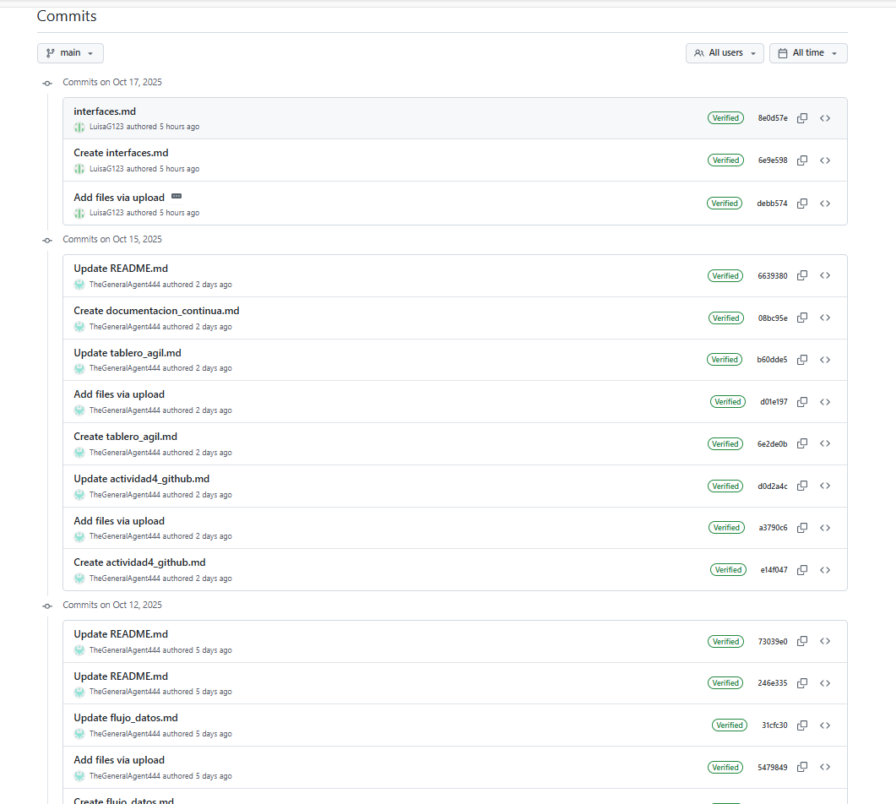

#  Informe Final del Proyecto  
## Guía Turística Inteligente con IA y Geolocalización

**Fundación Universitaria Lumen Gentium (UNICATÓLICA)**  
**Asignatura:** Desarrollo de Software I  
**Docente:** Stephany Ramírez Posada  

**Integrantes:**  
- Jose Luis Hoyos Salazar (ID: 408716)  
- Luisa Gironza Beltrán (ID: 408993)

---

##  1. Descripción del Sistema

La Guía Turística Inteligente con IA y Geolocalización es una aplicación móvil diseñada para asistir a los usuarios en la planificación y exploración de destinos turísticos.  
Combina tecnologías de inteligencia artificial (IA), geolocalización y análisis de datos para ofrecer experiencias personalizadas.

###  Objetivos del Sistema
- Ofrecer recomendaciones turísticas inteligentes según las preferencias del usuario.  
- Generar itinerarios automáticos adaptados a clima, tráfico y tiempo disponible.  
- Permitir la gestión de reseñas, calificaciones y destinos favoritos.  
- Mejorar la experiencia del turista mediante notificaciones y rutas interactivas.  

###  Funcionalidades Clave
- Inicio de sesión y registro de usuarios.  
- Mapa interactivo con puntos turísticos y rutas.  
- Recomendaciones personalizadas mediante IA.  
- Gestión de itinerarios dinámicos.  
- Reseñas y calificaciones de destinos.  

---

##  2. Arquitectura del Sistema

El sistema adopta una arquitectura modular de tres capas, que permite la escalabilidad y mantenimiento del software:

1. **Capa de Presentación (Interfaz de Usuario):**  
   Desarrollada en tecnologías móviles, responsable de la interacción directa con el usuario.  
2. **Capa de Lógica de Negocio:**  
   Gestiona los procesos principales del sistema: generación de itinerarios, IA de recomendaciones y manejo de reseñas.  
3. **Capa de Datos:**  
   Administra el almacenamiento en bases de datos y la persistencia de la información.  

 **Diagrama de Arquitectura Modular:**  

---

##  3. Flujo de Información y Estructuras de Datos

La comunicación entre capas sigue un flujo de ida y retorno, donde los datos del usuario viajan desde la interfaz, se procesan en la lógica de negocio y retornan con resultados personalizados.

| Módulo | Estructura de datos usada | Descripción |
|---------|---------------------------|--------------|
| Usuarios | Registro (JSON / Diccionario) | Almacena nombre, correo, preferencias. |
| Itinerarios | Lista enlazada | Organiza las rutas y actividades. |
| Recomendaciones | Árbol de decisión | Determina sugerencias por IA. |
| Reseñas | Lista de objetos | Guarda opiniones y calificaciones. |
| Notificaciones | Cola FIFO | Envía alertas personalizadas. |

 **Diagrama de Flujo de Información:**  

---

##  4. Modelo de Clases UML

El diseño orientado a objetos se modeló mediante un diagrama UML de clases, donde se representan las principales entidades del sistema:

- **Usuario**
- **DestinoTurístico**
- **Itinerario**
- **Recomendación**
- **Reseña**
- **Notificación**

Cada clase define sus atributos y métodos, evidenciando relaciones de composición y agregación entre ellas.

 **Diagrama UML de Clases:**  

---

##  5. Interfaces de Usuario

Se diseñaron tres pantallas principales que componen el flujo de interacción:

| Pantalla | Función |
|-----------|----------|
| **Inicio de Sesión** | Permite autenticación de usuarios. |
| **Mapa Principal** | Muestra lugares cercanos y rutas. |
| **Itinerario Personalizado** | Gestiona actividades del viaje. |

 **Mockups de Interfaz:**  
  

---

##  6. Gestión Ágil del Proyecto (Jira)

El equipo implementó una metodología ágil mediante un tablero Kanban en Jira, estructurado en tres columnas:

- **To Do:** tareas por realizar.  
- **In Progress:** tareas en desarrollo.  
- **Done:** tareas finalizadas.  

 **Tablero Kanban:**  

### Ejemplo de tareas del tablero:
| ID | Tarea | Responsable | Estado |
|----|--------|--------------|--------|
| 1 | Definir arquitectura modular | Jose Luis | Done |
| 2 | Crear diagrama de flujo de datos | Luisa | Done |
| 3 | Diseñar interfaces y mockups | Ambos | In Progress |
| 4 | Documentar tablero ágil | Jose Luis | To Do |
| 5 | Subir documentación final | Ambos | Done |

---

##  7. Control de Versiones (GitHub)

El proyecto se gestionó en un repositorio grupal con la siguiente estructura:
guia-turistica-inteligente/
│
├── docs/ → Documentación técnica
├── interfaces/ → Diagramas, mockups y evidencias
└── README.md → Descripción general del proyecto

 **Evidencia de commits del equipo:**  

---

##  8. Conclusiones Generales

- El desarrollo del proyecto permitió aplicar los principios de ingeniería de software, utilizando herramientas profesionales como GitHub, Figma, Draw.io y Jira.  
- La documentación continua facilitó el seguimiento del avance y la trazabilidad de los aportes individuales.  
- La metodología ágil Kanban mejoró la organización del trabajo colaborativo y la gestión del tiempo.  
- El sistema propuesto demuestra la viabilidad de integrar IA y geolocalización para mejorar la experiencia turística.  

---

##  9. Referencias

- Pressman, R. (2010). *Ingeniería de Software: Un enfoque práctico*. McGraw-Hill.  
- Sommerville, I. (2011). *Software Engineering*. Pearson Education.  
- Nielsen, J. (1993). *Usability Engineering*. Academic Press.  
- Atlassian (2024). *Jira Software Documentation*. Atlassian Inc.

---

 **Versión final:** Octubre de 2025  
 Documento consolidado por el equipo de Desarrollo de Software I.

