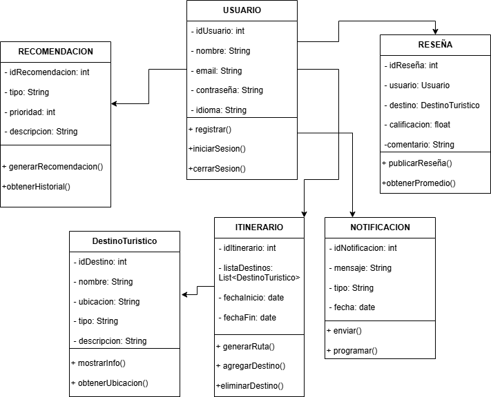

# Guía Turística Inteligente con IA y Geolocalización
## Modelo de Clases UML

**Fundación Universitaria Lumen Gentium (UNICATÓLICA)**  
**Asignatura:** Desarrollo de Software I  
**Docente:** Stephany Ramírez Posada  
**Integrantes:**  
- Luisa Gironza Beltrán (ID: 408993)  
- Jose Luis Hoyos Salazar (ID: 408716)

---

### 🎯 Propósito del Documento
El propósito de este documento es definir el **modelo de clases UML** para representar las entidades, atributos, métodos y relaciones del sistema “Guía Turística Inteligente con IA y Geolocalización”.

Este modelo se basa en la arquitectura modular definida previamente y sirve como base para la implementación en código.

---

### 1. Identificación de Clases Principales

| Clase | Descripción | Atributos | Métodos |
|-------|--------------|-----------|----------|
| **Usuario** | Representa a los usuarios del sistema. | idUsuario, nombre, email, contraseña, idioma | registrar(), iniciarSesion(), cerrarSesion() |
| **DestinoTuristico** | Contiene la información de los lugares turísticos. | idDestino, nombre, ubicación, tipo, descripción | mostrarInfo(), obtenerUbicacion() |
| **Itinerario** | Administra la planificación de viajes del usuario. | idItinerario, listaDestinos, fechaInicio, fechaFin | generarRuta(), agregarDestino(), eliminarDestino() |
| **Recomendacion** | Gestiona las sugerencias personalizadas mediante IA. | idRecomendacion, tipo, prioridad, descripcion | generarRecomendacion(), obtenerHistorial() |
| **Reseña** | Permite que los usuarios opinen sobre los destinos. | idReseña, usuario, destino, calificacion, comentario | publicarReseña(), obtenerPromedio() |
| **Notificacion** | Envía alertas automáticas a los usuarios. | idNotificacion, mensaje, tipo, fecha | enviar(), programar() |

---

### 2. Relaciones entre Clases
- Un **Usuario** puede crear varios **Itinerarios**.  
- Cada **Itinerario** contiene múltiples **DestinosTuristicos**.  
- Un **Usuario** puede generar múltiples **Reseñas** y **Recomendaciones**.  
- Las **Notificaciones** están asociadas al **Usuario** según sus preferencias o alertas de viaje.  

---

### 3. Diagrama UML de Clases

El siguiente diagrama ilustra la estructura y relaciones entre las clases del sistema:

 
